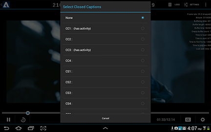

# Closed captions

* When you select a media item, you are provided with a user interface where you can choose to view closed captions for that item. Active tracks are indicated by a `has activity` message. Selecting an active track turns its visibility on.
* If you select CC, all the closed caption tracks for the media item are displayed.
* To remove the closed captions, select None from the chooser dialog.

To implement closed captions, you need to edit . 
  
The PlayerFragment calls the  <!-- APINAME - Required Post Migration Cleanup --> `displayClosedCaptioningDialog()` function, which populates the captions array with the tracks returned from the `CCManager`, using the function  <!-- APINAME - Required Post Migration Cleanup --> `getClosedCaptionTracks()`. 
When you select a language, the index or the language is passed back to the `CCManager` to be displayed on the device. If you select None, no captions are displayed. 
The `selectClosedCaptionTrack()` function from `CCManager` provides a list of all tracks in the player interface. 
The reference implementation reads the configuration parameters from the Android `SharedPreferences` file, for convenience. You can configure the player to read configuration from whatever source you are currently using. 
