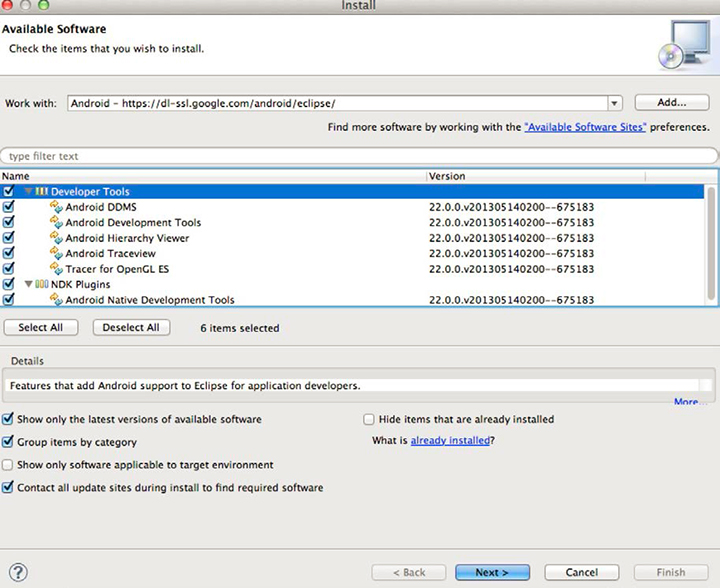

# Download and configure prerequisite software


>1. Download the JDK from [ http://www.oracle.com/technetwork/java/javase/downloads/ ](http://www.oracle.com/technetwork/java/javase/downloads/).
>   The installation process is straightforward. If you already have the JDK installed on your system, you can skip this step, but be aware that your JDK, Eclipse IDE, and OS need to be compatible.>
>1. Download the Eclipse IDE for Java Developers from [ http://www.eclipse.org/downloads ](http://www.eclipse.org/downloads).
>   After unzipping the package, you can run Eclipse directly. There is no installer.>
>1. Download the Android SDK ADT Bundle from [ http://developer.android.com/sdk/index.html ](http://developer.android.com/sdk/index.html).
>   This bundle includes Eclipse. If you already have Eclipse installed on your system, you can download the SDK Tools for your platform from the ** ` Use An Existing IDE` ** section.>
>   Unpack and install to a location you will remember. You will need to reference this in a later step.>
>1. Configure the Android SDK.
>   >1. Open a terminal (in Mac OS X) or a command prompt (in Windows).
>   >1. Navigate to the directory where you downloaded/unpacked the Android SDK.
>   >1. Go to the tools folder, which contains a file named ` android`.
>   >1. Run the following commands:
>   >    
>   >    * For Mac OS X/Unix: >   >    
>   >      ```
>   >      >   >      chmod +x android 
>   >      android update sdk --no-ui 
>   >      
>   >      ```

>   >    * For Windows: >   >    
>   >      ```
>   >      >   >      android update sdk --no-ui 
>   >      
>   >      ```

>   >       This process takes a while.
>   >    
>1. Configure Eclipse.
>   >1. Start Eclipse.

>   >       On Windows, if Eclipse does not start, and the issue reported is that Eclipse cannot find a required Java file, try the following:
>   >       add ` -vm C:\[path to your JDK bin]\javaw.exe` to your ` eclipse.ini` file. 
>   >1. Select  ** ` Help` ** &gt; ** ` Install New Software` ** .
>   >1. Click ** ` Add...` **.
>   >1. Enter ` Android` for the name.
>   >1. Enter ` https://dl-ssl.google.com/android/eclipse/` for the ** ` Work with` ** link.
>   >1. Click ** ` OK` **.

>   >       You should see a dialog similar to this:
>   >       <a id="fig_A1CC171097644E4D892F7FA31B821237"></a>  
>   >1. Select the resulting packages (those in Developer Tools and NDK Plugins) and click ** ` Next` **.
>   >   This downloads the Android Development Tools (ADT).>   >
>   >1. After the download completes, restart Eclipse.

>1. Configure Eclipse so it can find the Android SDK and use it as a resource.
>   >1. Open Eclipse.
>   >1. Select  ** ` Window` ** &gt; ** ` Preferences` ** on Windows;  ** ` ADT` ** &gt; ** ` Preferences` ** on Mac OS X.
>   >1. Select the ** ` Android` ** tab.
>   >1. Browse to the location of the Android SDK.
>   >1. Click ** ` Apply` **.

>   >       <a id="fig_EDC325C7076F4C75938FCBB5F37403BC"></a>  
