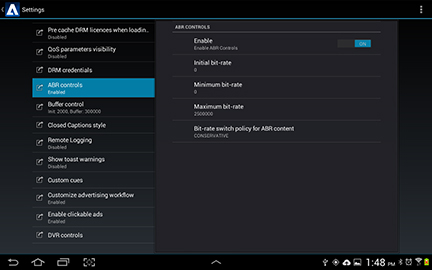

# Enabling custom ABR control in the reference implementation

Adaptive bit rate (ABR) is enabled in the TVSDK by default. You can use the Primetime Settings user interface to override the default TVSDK behavior in the reference implementation by configuring custom ABR control.

To enable custom ABR through the Settings user interface: 

1. Open the Primetime Settings dialog.
1. Select **[!UICONTROL ABR controls]**.

    
1. Tap the Enable ON control so that it displays OFF.
1.

>The `PlaybackManager` only sets the ABR parameters if [isABRControlEnabled](http://help.adobe.com/en_US/primetime/reference_implementation/android/javadoc/com/adobe/primetime/reference/config/IPlaybackConfig.html) returns true (ON). If it returns false (OFF), the `PlaybackManager` uses the default ABR control so the initial, minimum, and maximum bit rates will all be 0 and the ABR policy will be `ABR_MODERATE`. 
