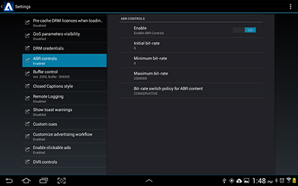

# Multiple bit rates {#multiple-bit-rates}

The TVSDK can play videos that have multiple profiles with different bit rates, switching between them to provide more than one quality level based on the available bandwidth.

You can set initial, minimum, and maximum bit rates as well as the adaptive bit-rate (ABR) switch policy for a multiple bit rate (MBR) stream. The TVSDK automatically switches to the bit rate that provides the best playback experience within the specified configuration.

The reference implementation configures the following ABR parameters in [IPlaybackConfig](https://help.adobe.com/en_US/primetime/api/reference_implementation/android/javadoc/com/adobe/primetime/reference/config/IPlaybackConfig.html).  

|Parameter|Description|
|--- |--- |
|Initial bit rate:  getABRInitialBitRate|The desired playback bit rate (in bits per second) for the first segment. When playback starts, the closest profile (equal to or greater than the initial bit rate) is used for the first segment.  If a minimum bit rate is defined and the initial bit rate is lower than the minimum, the TVSDK selects the profile with the lowest bit rate above the minimum bit rate. Similarly, if the initial rate is above the maximum rate, the TVSDK selects the highest rate below the maximum. If the initial bit rate is zero or undefined, the initial bit rate is determined by the ABR policy.  Returns an integer value that represents the byte-per-second profile.|
|Minimum bit rate:  getABRMinBitRate|The lowest allowed bit rate to which the ABR can switch. ABR switching ignores profiles with a bit rate lower than this. Returns an integer value that represents the bits-per-second profile.|
|Maximum bit rate:  getABRMaxBitRate|The highest allowed bit rate to which the ABR can switch. ABR switching ignores profiles with a bit rate higher than this. Returns an integer value that represents the bits-per-second profile.|
|ABR switching policy:  getABRPolicy|The playback switches gradually to the highest-bit-rate profile when possible. You can set the policy for ABR switching, which determines how quickly the TVSDK switches between profiles. The default is Moderate. <ul><li>*Conservative*: Switches to the profile with the next higher bit rate when the bandwidth is 50% higher than the current bit rate. </li><li>*Moderate*: Switches to the next higher bit rate profile when the bandwidth is 20% higher than the current bit rate.</li><li>*Aggressive*: Switches immediately to the highest bit-rate profile when the bandwidth is higher than the current bit rate</li></ul> If the initial bit rate is zero or not specified and a policy is specified, playback starts with the lowest bit-rate profile for Conservative, the profile closest to the median bit rate of available profiles for Moderate, and the highest bit-rate profile for Aggressive.  The policy works within the constraints of the minimum and maximum bit rates, if they are specified.  Returns the current setting from the  ABRControlParameters enum: <ul><li>ABR_CONSERVATIVE</li><li>ABR_MODERATE </li><li>ABR_AGGRESSIVE</li></ul> See also [ABRPolicy](https://help.adobe.com/en_US/primetime/api/psdk/javadoc/com/adobe/mediacore/ABRControlParameters.ABRPolicy.html).|

>[!NOTE]
>
>* The TVSDK failover mechanism might override these settings, because the TVSDK favors a continuous playback experience over strictly respecting the control parameters. 
>* When the bit rate changes, the TVSDK dispatches `onProfileChanged` events in `PlaybackEventListener`. 

## Enabling custom ABR control in the reference implementation {#section_72A6E7263E1441DD8D7E0690285515E6}

Adaptive bit rate (ABR) is enabled in the TVSDK by default. You can use the Primetime Settings user interface to override the default TVSDK behavior in the reference implementation by configuring custom ABR control.

To enable custom ABR through the Settings user interface:

* Open the Primetime Settings dialog. 
* Select **[!UICONTROL ABR controls]**. 

  

* Tap the [!UICONTROL Enable ON] control so that it displays `OFF`.

The `PlaybackManager` only sets the ABR parameters if [isABRControlEnabled](https://help.adobe.com/en_US/primetime/api/reference_implementation/android/javadoc/com/adobe/primetime/reference/config/IPlaybackConfig.html) returns true (ON). If it returns false (OFF), the `PlaybackManager` uses the default ABR control so the initial, minimum, and maximum bit rates will all be 0 and the ABR policy will be `ABR_MODERATE`.

## Configure for low bit rates {#section_5451691CBBD24542AD54A474D222CD39}

For some low bit-rate playback rates, the TVSDK, by default, switches to the audio-only stream and the playback appears frozen. You can configure the player so that it never encounters a situation where it switches to audio-only.

* Implement the [IPlaybackConfig](https://help.adobe.com/en_US/primetime/api/reference_implementation/android/javadoc/com/adobe/primetime/reference/config/IPlaybackConfig.html) interface:

* Ensure that [getABRMinBitRate](https://help.adobe.com/en_US/primetime/api/reference_implementation/android/javadoc/com/adobe/primetime/reference/config/IPlaybackConfig.html#getABRMinBitRate()) is higher than the audio-only bit rate (higher than 64000). 
* Ensure that [isABRControlEnabled](https://help.adobe.com/en_US/primetime/api/reference_implementation/android/javadoc/com/adobe/primetime/reference/config/IPlaybackConfig.html#isABRControlEnabled()) is on.