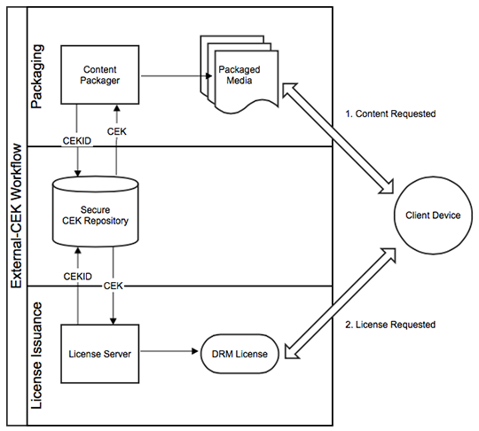

# AAXS DRM External CEK Workflow{#aaxs-drm-external-cek-workflow}

 This workflow is a departure from most existing DRM systems, as it does not require the use of any central repository or Content Key Management System (CKMS). However, for customers that desire AAXS to work with their existing CKMS, AAXS provides a feature called "External CEK", in which the CEK is supplied externally at packaging and license issuance time. 

{width="540px"}

1. (Package) The AAXS Java SDK is provided with a CEK and a CEK ID.
1. (Package) The CEK is used to encrypt content.
1. (Package) The CEK ID is inserted into the content's DRM metadata.
1. The device attempts to play content by requesting a license from the AAXS server.
1. (Licensing) The AAXS server extracts the CEK ID from the content metadata.
1. The AAXS server retrieves the CEK from the CKMS.
1. (Licensing) The AAXS server issues to the device a license that contains the CEK.
