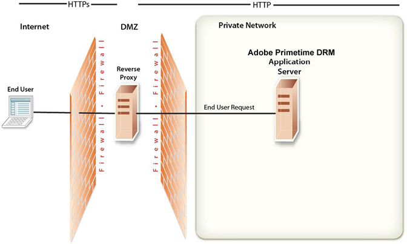

# Network topology overview {#network-topology-overview}

After you successfully deploy Adobe Access, it is important to maintain the security of your environment. This section describes the tasks that are necessary to maintain the security of your Adobe Access production server.

Use a *reverse proxy* to ensure that different sets of URLs for Adobe Access web applications are available to both external and internal users. This configuration is more secure than allowing users to connect directly to the application server on which Adobe Access is running. The reverse proxy performs all HTTP requests for the application server that is running Adobe Access. Users only have network access to the reverse proxy and can attempt only the URL connections that are supported by the reverse proxy. 

