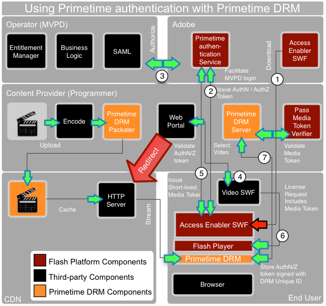

# Adobe Primetime authentication and Adobe Primetime DRM{#adobe-primetime-authentication-and-adobe-primetime-drm}

Adobe Primetime authentication ( [http://www.adobe.com/products/adobepass/](http://www.adobe.com/products/adobepass/)) provides user/device authentication and authorization across multiple content providers. The user must have a valid cable TV or satellite TV subscription. 

Adobe Primetime authentication can be used along with Adobe Primeitme DRM for protecting the media content. In this scenario, The video player (SWF) can load another SWF called the *Access Enabler*, which is hosted by Adobe Systems. The *Access Enabler* is used to connect to the Adobe Primetime authentication service, and facilitate SAML SSO integration with MVPD’s (Multichannel Video Programming Distributor) identity provider systems. This involves redirecting the user’s browser briefly to the MVPD login page, then persisting an AuthN token and finally return to the content web site with a cached AuthN session.

The *Access Enabler* can then facilitate backend authorizations between Adobe Primetime authentication service and the MVPD. The MVPD maintains the business logic and determines what content the user is entitled to. The entitlement is persisted in an additional AuthZ token for that content resource and is sent back to the client.

The authentication and authorization tokens are signed using the unique ID and private key of the Primetime DRM client to avoid tampering or spoofing. This token can only be accessed via the *Access Enabler*.

The video player can trigger the process by calling `getAuthorization` on the *Access Enabler*. When valid AuthN/AuthZ tokens are present, the *AccessEnabler* issues a callback to the video player that will include a short-lived media token for playing the video content.

Adobe Primetime authentication provides a media token validator Java library that can be deployed to a server. When using the Primetime DRM server for content protection, you can integrate the media token validator with a Primetime DRM server-side plug-in to automatically issue a generic license after successfully validating the media token. The content is then streamed from the CDN servers to the client. To acquire a content license, the short-lived media token can be submitted to the Primetime DRM server, where the validity of the token is verified and a license can be issued.

The long-lived AuthN token is used generally by the *Access Enabler* across all content developers to represent the AuthN for that MVPD subscriber. In addition, the Primetime DRM Server and Token Verifier can be operated by the CDN or a service provider on behalf of the content provider. 
