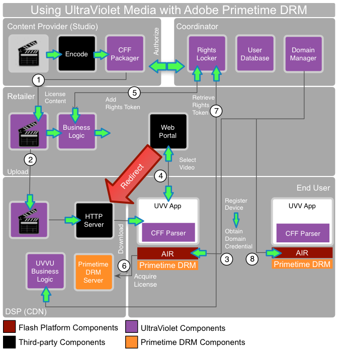

# UltraViolet media and Adobe Primetime DRM{#ultraviolet-media-and-adobe-primetime-drm}

Adobe Primetime DRM can be used with other third-party content streaming solutions to set up a complete and secure DRM-based media distribution ecosystem.

UltraViolet ( [https://www.myuv.com/](https://www.uvvu.com/)) is a digital rights authentication and cloud-based distribution system that can enable consumers of digital home entertainment content to stream and download purchased content through multiple platforms and devices. UltraViolet content will be downloaded (or streamed) in a Common File Format, (CFF) using Common Encryption (CENC).

It is easy to set up an UltraViolet system along with Adobe Primetime DRM. The following use case depicts the content flow behavior: 

<!---->

1. The content owner encodes and packages the content in CFF. The packaged content is licensed to a retailer for distribution. 
1. The retailer uploads the content to a digital service provider, like CDN. The content is now available for download. Note that some of these roles can be played by one or more companies.

   The end user has a device that supports Adobe AIR. In addition to that, the user needs to install an UltraViolet-compliant application. The application includes the necessary code to parse the CFF and present it for consumption by the runtime. All the sensitive cryptographic operations are handled in the secure runtime. 
1. The application can trigger a domain join for the device, which interacts with the co-ordinator. The co-ordinator maintains a rights locker, a user database and domains. The co-ordinator’s domain manager is built using the Primetime DRM SDK to implement Primetime DRM-specific domain join/leave operations. 
1. The user can then use the application to select a video they want to acquire from the retailer. The retailer typically provides a web portal and handles all business logic. 
1. The retailer then interacts with the co-ordinator to add a rights token. The retailer then redirects the request to the service provider for the actual content download. 
1. If the device does not yet have a license to the content, it triggers a license request using the CFF. The request typically includes a domain certificate, user credentials and information about the application. The service provider operates an Primetime DRM License Server (developed using the Primetime DRM SDK) that follows the UltraViolet specifications. 
1. The service provider’s UltraViolet business logic interacts with the co-ordinator as needed to retrieve the appropriate rights token to determine whether a content license should be issued.

   The content license is bound to the domain. The client application can insert the license into the CFF file. Content can now be played back in the application, with all protection and usage rule enforcement handled by the Primetime DRM component in the runtime. 
1. Other devices and applications owned by the same end user can be registered with the co-ordinator. The content can now be loaded in other Primetime DRM devices without requiring any external transaction.

