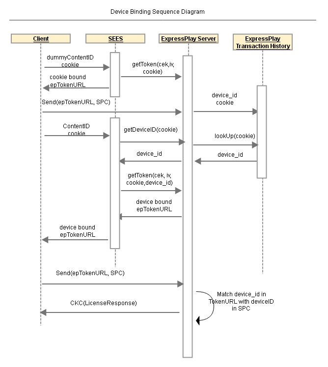

# Reference Service: Device-Binding Entitlement {#reference-service-device-binding-entitlement}

The SEES reference server shows you how to enable the device-binding entitlement service using ExpressPlay.

>[!NOTE]
>
>The device-bound entitlement service can also be time-bound or provide rental duration.

To bootstrap the `device_id` information, playback a dummy M3U8 content. You can then embed a cookie in the ExpressPlay token, generate an SPC (which contains the `device_id`), and send a `getToken` to the ExpressPlay Server.

The sequence starts by playing a dummy M3U8. A cookie is sent to the SEES server to get the ExpressPlay token URL. After receiving the cookie-bound ExpressPlay token URL, the next step is to generate the SPC and send it to the ExpressPlay Server. The ExpressPlay server extracts the `device_id` from SPC, the cookie from the ExpressPlay token URL, and puts the cookie and `device_id` in the transaction log.

The client makes a real license request to SEES sending the same cookie. SEES employs the cookie to retrieve the `device_id` from the ExpressPlay server.

SEES requests an ExpressPlay token that is device-bound as well as time-bound and returns that token to the client.

The client makes the license request with the ExpressPlay token.

The ExpressPlay server compares the `device_id` in the SPC with the `device_id` in the ExpressPlay token. The ExpressPlay server only issues a license if the two `device_id` values match.
