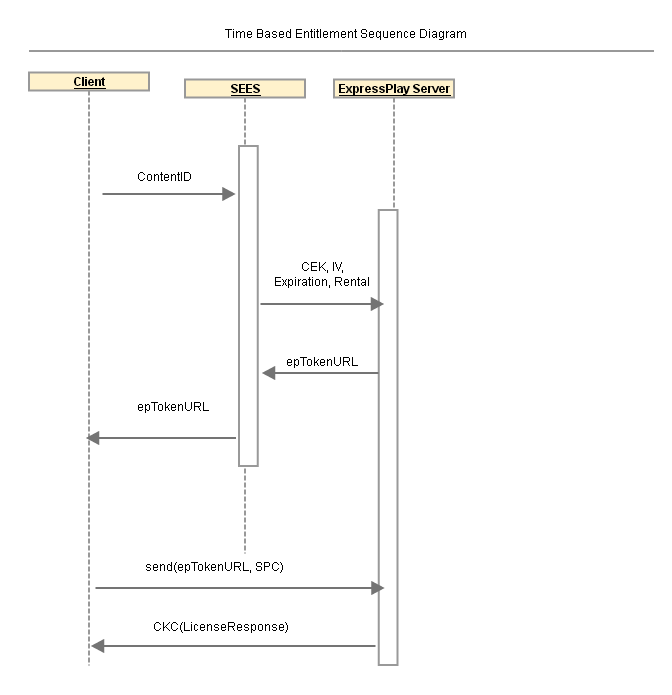

# Reference Service: Time-based Entitlement{#reference-service-time-based-entitlement}

Work with the SEES to see how to enable a time-based entitlement service using ExpressPlay.

The SEES receives an Entitlement Request (see Public API section) from the client. The SEES server looks up the CEK and IV based on the `contentID`, adds the `expirationTime`, and forwards the request to the ExpressPlay server. The final ExpressPlay token is time-bound. See the Time Based Entitlement sequence diagram below. 

#### License Parameters sent by client
|  Query Parameter  | Description  | Required  |
|---|---|---|
| `contentKey`  | A 16 byte hexadecimal string representation of the content encryption key  | Yes  |
| `iv`  | A 16 byte hexadecimal string representation of the content encryption IV  | Yes  |
| `rentalDuration`  | Duration of the rental in seconds (default = 0)  | No  |

#### Token Restriction Parameters added by SEES Server
<table id="table_E979FAD7A61A4832A46667301939FAEB">  
 <thead> 
  <tr> 
   <th class="entry"> Query Parameter </th> 
   <th class="entry"> Description </th> 
   <th class="entry"> Required? </th> 
  </tr> 
 </thead>
 <tbody> 
  <tr> 
   <td> expirationTime </td> 
   <td>Expiration time of this token. This value must be a string in <a href="http://www.ietf.org/rfc/rfc3339.txt" format="html" type="external"> RFC 3339</a> date/time format in the 'Z' zone designator ("Zulu time"), or an integer preceded by a '+' sign. An example of an RFC 3339 date/time is  2006-04-14T12:01:10Z. 
If the value is a string in RFC 3339 date/time format, then it represents an absolute expiration date/time for the token. If the value is an integer preceded by a '+' sign, then it is interpreted as a relative number of seconds from issuance that the token is valid. For example,  +60 specifies one minute. The maximum (and default, if not specified) token lifetime is 30 days. Use the encoded form "%2B" when specifying the '+' sign. 
 </td> 
   <td> No </td> 
  </tr> 
 </tbody> 
</table>

