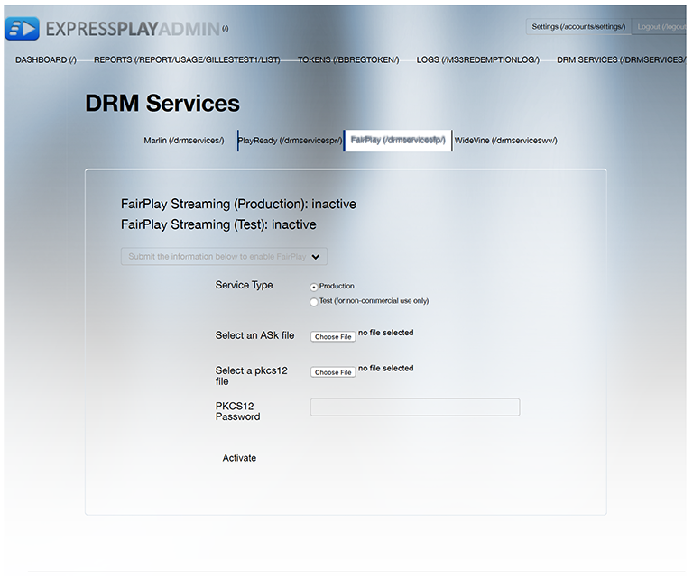

# Multi-DRM Workflow for FairPlay {#multi-drm-workflow-for-fairplay}

The DRM workflows involve packaging your content, providing licensing for the content, and playing back the protected content from your own video application. The workflow is generally similar for each DRM solution, but with some differences is in the details.

This Multi-DRM workflow takes you through setup, packaging, licensing, and playback of HLS content protected with Apple FairPlay. This workflow also includes optional instructions for implementing offline playback and license rotation.

## Enable ExpressPlay service for FairPlay {#enable-expressplay-service-for-fairplay}

The FairPlay DRM solution from Apple requires some setup when you use it with the ExpressPlay DRM services. This involves obtaining credentials from Apple and uploading them to ExpressPlay.

Follow these steps to enable ExpressPlay service for FairPlay content protection. 

1. Obtain credentials from Apple.

   These credentials are provisioned uniquely to each service provider. You must request them by completing the following form: [https://developer.apple.com/contact/fps/](https://developer.apple.com/contact/fps/). 

   >[!NOTE]
   >
   >Select **[!UICONTROL Content Provider]** for Primary Role.

   Once your request is approved, Apple will send you a *FairPlay Streaming Deployment Package*.
1. Generate a Certificate Signing Request.

       You can use [!DNL openssl] to generate your public/private key pair, and your certificate signed request (CSR).

    1. Generate your key pair.     
    
       ```    
       openssl genrsa -aes256 -out privatekey.pem 1024 
       ```    
    
    1. Generate your CSR.     
    
       ```    
       openssl req -new -sha1 -key privatekey.pem -out certreq.csr  
         -subj "/CN=SubjectName /OU=OrganizationalUnit /O=Organization /C=US"
       ```

       >[!NOTE]
       >
       >The instructions for this step are located in your *FairPlay Streaming Deployment Package*, but are included here for your convenience. If you have issues with this part of the process, check the instructions in *FairPlayCertificateCreation.pdf* (in your deployment package).

1. Upload your CSR through the Apple developer portal.
   1. The Team Agent for your development team must log into [!DNL developer.apple.com/account].
   1. Click on **[!UICONTROL Certificates, Identifiers & Profiles]**, then select the **[!UICONTROL iOS, tvOS, watchOS]** drop-down on the upper left of the page, then click on **[!UICONTROL Certificates->Production]** on the left of the page.
   1. Click the **[!UICONTROL +]** button on the upper right of the page to request a new certificate. Select the **[!UICONTROL FairPlay Streaming Certificate]** option under **[!UICONTROL Production]**.
   
      The *Add iOS Certificate* dialog opens.   
   1. In the *Add iOS Certificate*, upload the CSR file you generated in Step 2.b., and click **[!UICONTROL Generate]**.
   
      Your Application Secret Key (ASK) is displayed in the same dialog.   
   1. Write down your ASK, and store it in a safe location.
   1. Key in your ASK to complete certificate generation and click **[!UICONTROL Continue]**.
   1. After you verify that you have saved your ASK, click **[!UICONTROL Generate]** to continue.

      >[!NOTE] {importance="high"}
      >
      >It is important that you save a copy of your ASK and store it securely. *If your ASK is compromised, you will no longer be able to protect your content with FairPlay Streaming.* Only one (1) ASK is allocated to your team. The value will not be provided again and you cannot retrieve it at a later time.

   1. Download your FPS Certificate.
   
      Be sure to save a backup copy of your private key (from Step 2.a.) and your public key (the FPS Certificate you downloaded in this step) in a safe place.   
1. Set up your ExpressPlay account with your FairPlay credentials.
   1. Let's say the certificate name you downloaded in Step 3.h. is [!DNL fairplay.cer].
   1. Open the [!DNL fairplay.cer] file with the Apple Keychain Access utility.
   1. Filter your many certificates by entering " `fairplay`" in the search field located up on the top right.
   1. Identify your company's FairPlay certificate.
   
      Your company name should be associated with the certificate issued by Apple.   
   1. Expand the certificate by selecting the expand arrow, and right-click on your private key.
   1. Select **[!UICONTROL Export "Your Company Name"]** and save the [!DNL .p12] file.
   
      You will be asked to assign a password to secure this file. Make a note of this password as you will need to send this with your credentials package.   
   1. Login to your account on [www.expressplay.com](https://www.expressplay.com).
   1. Click **[!UICONTROL DRM SERVICES]** on the upper left, then select the **[!UICONTROL FairPlay]** tab.
   1. Upload your FairPlay credentials to your ExpressPlay account.

       1. Create a text file that contains the value of your ASK (this should be 32 characters, for example: `1234567890abcdef1234567890abcdef`), and select this file for upload. 
       1. Select the PKCS12 file from Step 4.f. for upload. 
       1. Enter the PKCS12 file password from Step 4.f. 
       1. Click the Upload button.

>Now you can create iOS applications or HTML5 pages with FairPlay content protection along with your [!DNL fairplay.cer] certificate using the ExpressPlay service for FairPlay. >
><!--<a id="fig_sjr_2pn_sv"></a>-->
>

### Package your content for FairPlay {#package-your-content-for-fairplay}

To package you content, you can use either Adobe Offline Packager or other tools such as ExpressPlay's Bento4 packager.

Packagers prepare the video for playback (e.g., fragmenting the original file and putting it into a manifest), and protect the video with your chosen DRM solution (in this case FairPlay):

* [Adobe Offline Packager for FairPlay DRM](https://helpx.adobe.com/content/dam/help/en/primetime/guides/offline_packager_getting_started.pdf#page=21) 
* [ExpressPlay Packagers - Bento4 for HLS](https://www.bento4.com/developers/hls/)

<!--<a id="fig_jbn_fw5_xw"></a>-->


1. Package your content.

       Here is a packaging example using Adobe Offline Packager. The Packager uses a configuration file (e.g., [!DNL fairplay.xml]), which looks something like this:     
    
       ```    
       <config>
       <in_path>mp4_file_path</in_path>
       <out_type>hls</out_type>
       <out_path>out_file_path</out_path>
       <drm/>
       <drm_sys>FAIRPLAY</drm_sys>
       <frag_dur>4</frag_dur>
       <target_dur>6</target_dur>
       <key_file_path>creds/fairplay.bin</key_file_path>
       <iv_file_path>creds/iv.bin</iv_file_path>
       <key_url>user_provided_value</key_url>
       <content_id>_default_</content_id>
       </config>
       ```

    * `in_path` - This entry points to the location of the source video on your local packaging machine. 
    * `out_type` - This entry describes the type of the packaged output, in this case HLS for FairPlay. 
    * `out_path` - The location on the local machine where you want your output to go. 
    * `drm_sys` - The DRM solution you are packaging for. This is `FAIRPLAY` in this case. 
    
    * `frag_dur` - Fragment duration in seconds. 
    * `target_dur` - The target duration for HLS output. 
    * `key_file_path` - This is the location of the license file on your packaging machine that serves as your Content Encryption Key (CEK). It is a Base-64 encoded 16-byte hex string. 
    * `iv_file_path` - This is the location of the IV file on your packaging machine. 
    * `key_url` - The URI parameter of the `EXT-X-KEY` tag of the [!DNL .m3u8] file. 
    
    * `content_id` - Default value.

       As stated in the [Packager documentation](https://helpx.adobe.com/content/dam/help/en/primetime/guides/offline_packager_getting_started.pdf#page=7), "As a best practice, create a configuration file that contains the common options that you want to use for generating the outputs. Then, create the output by providing specific options as a command-line argument."

       ```    
       java -jar OfflinePackager.jar -in_path sample.mp4 -out_type hls 
       -out_path out_file_path -drm -drm_sys FAIRPLAY -key_file_path "creds/fairplay.bin" 
       -key_url "user_provided_value"
       ```

       The generated M3U8 file has an `EXT-X-KEY` attribute that appears as follows:     
    
       ```    
       #EXT-X-KEY:METHOD=SAMPLE-AES,URI="user_provided_value",​
       KEYFORMAT="com.apple.streamingkeydelivery",KEYFORMATVERSIONS="1" 
       ```

### Setting policies for FairPlay {#setting-policies-for-fairplay}

You can set polices for FairPlay-protected content by using an entitlement server. You can set up your own, or make use of an Adobe-provided sample entitlement server.

Adobe provides a Sample ExpressPlay Entitlement Server (SEES) that shows how to do *time-based* and *device-binding* entitlement. This sample entitlement server is built on top of ExpressPlay services.

[Reference Server: Sample ExpressPlay Entitlement Server (SEES)](../../multi-drm-workflows/feature-topics/sees-reference-server.md)

* [Reference Service: Time-based Entitlement](../../multi-drm-workflows/feature-topics/sees-reference-server-time-entitlement.md)
* [Reference Service: Device-Binding Entitlement](../../multi-drm-workflows/feature-topics/sees-reference-server-binding-entitlement.md)

# Licensing and playback for FairPlay {#licensing-and-playback-for-fairplay}

Licensing and playback of FairPlay-protected content requires swapping of URL schemes, between the scheme used in the video manifest file (skd:) and the one used in ExpressPlay token requests (https:).

Instructions for implementing licensing and playback from an iOS TVSDK client are here: [Enable Apple FairPlay in TVSDK applications](../../../programming/tvsdk-3.4-for-ios/ios-3.4-drm-content-security/ios-3.4-apple-fairplay-tvsdk.md). You can also optionally implement offline playback and license rotation for FairPlay.

## HLS Offline with FairPlay {#section_047A05D1E3B64883858BC601CFC8F759}

You may want to make it possible for users to play FairPlay-protected content when its licensing is not retrievable because the player is isolated from the web (such as on an airplane).

Before you begin this task, download and read the Apple document **"Offline Playback with FairPlay Streaming and HTTP Live Streaming"**. Read the guide to learn how to download Transport Stream (TS) segments and save them to your local machine.

Implement offline play for FairPlay with this workflow:

1. Download the HLS TS segment. 
1. Request Persistent Rental license from the FairPlay server (see **"FairPlay Persistent Rental Policy"**). 
1. Save the `persistentContentKey`. 
1. Play the FairPlay content offline.

>[!NOTE]
>
>FairPlay Streaming on the client does not start decryption if the persisted content key has expired. However, it will continue the user experience if the content key expires during playback. 
>
>See [Working with HTTP Live Streaming](https://developer.apple.com/library/content/documentation/AudioVideo/Conceptual/MediaPlaybackGuide/Contents/Resources/en.lproj/HTTPLiveStreaming/HTTPLiveStreaming.html#//apple_ref/doc/uid/TP40016757-CH11-SW3) document for more details.

### FairPlay license rotation {#section_D32AA08C61474B4F876AC2A5F18CB879}

License rotation is a scheme for preventing license hacking of content that plays for a long time.

In an M3U8 manifest, each key tag will apply to the following TS segments until the next key tag, or until the end of the file.

To add license rotation, do the following:

* Insert a new FairPlay key tag during license rotation time.

  Any number of key tags can be added.

  For linear contents, make sure to maintain the most recent key tag in the M3U8 window. iOS will request the next M3U8 when there are about two TS segments left to be played (around 20 seconds). If the new M3U8 contains new key tags, all of the key requests will happen immediately. The previous existing keys will not be requested again. iOS will wait for all of the key requests to finish before playback will start.

  For VOD contents with license rotation, all of the key requests will happen at the beginning of playback.

  Following is a sample M3U8 with key rotation:

  ```
  #EXTM3U
  #EXT-X-TARGETDURATION:10
  #EXT-X-VERSION:5
  #EXT-X-MEDIA-SEQUENCE:0
  #EXT-X-PLAYLIST-TYPE:VOD
  #EXT-X-KEY:METHOD=SAMPLE-AES,URI="skd://one?cek=1dc2cc71d913f4f74eca0c4632
  212b25&iv=e21f0f72b6363ff6143737cb1e9ca8d7",KEYFORMAT="com.apple.streaming
  keydelivery",KEYFORMATVERSIONS="1"
  #EXTINF:10,
  fileSequence0.ts
  #EXTINF:10,
  fileSequence1.ts
  #EXTINF:10,
  fileSequence2.ts
  #EXTINF:10,
  fileSequence3.ts
  #EXTINF:10,
  fileSequence4.ts
  #EXTINF:10,
  fileSequence5.ts
  #EXTINF:10,
  fileSequence6.ts
  #EXTINF:10,
  fileSequence7.ts
  #EXTINF:10,
  #EXT-X-KEY:METHOD=SAMPLE-AES,URI="skd://two?cek=f6efc698b96cf8f4fa46d5237d
  337c77&iv=18401077091784bcda8079acf978dc95",KEYFORMAT="com.apple.streaming
  keydelivery",KEYFORMATVERSIONS="1"
  #EXTINF:10,
  fileSequence8.ts
  #EXTINF:10,

```