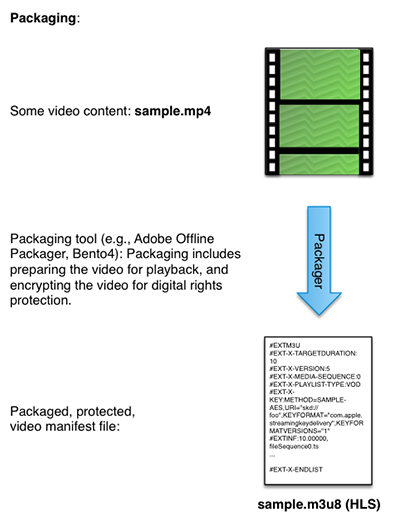

# Package your content for FairPlay{#package-your-content-for-fairplay}

To package you content, you can use either Adobe Offline Packager or other tools such as ExpressPlay's Bento4 packager.

Packagers prepare the video for playback (e.g., fragmenting the original file and putting it into a manifest), and protect the video with your chosen DRM solution (in this case FairPlay):

* [Adobe Offline Packager for FairPlay DRM](http://help.adobe.com/en_US/primetime/packagers/offline/index.html#Packagers-task-Protecting_content_using_FairPlay_DRM) 
* [ExpressPlay Packagers - Bento4 for HLS](https://www.bento4.com/developers/hls/)

<a id="fig_jbn_fw5_xw"></a>



1. Package your content.

       Here is a packaging example using Adobe Offline Packager. The Packager uses a configuration file (e.g., [!DNL fairplay.xml]), which looks something like this:     
    
       ```    
       <config>
       <in_path>mp4_file_path</in_path>
       <out_type>hls</out_type>
       <out_path>out_file_path</out_path>
       <drm/>
       <drm_sys>FAIRPLAY</drm_sys>
       <frag_dur>4</frag_dur>
       <target_dur>6</target_dur>
       <key_file_path>creds/fairplay.bin</key_file_path>
       <iv_file_path>creds/iv.bin</iv_file_path>
       <key_url>user_provided_value</key_url>
       <content_id>_default_</content_id>
       </config>
       ```

    * `in_path` - This entry points to the location of the source video on your local packaging machine. 
    * `out_type` - This entry describes the type of the packaged output, in this case HLS for FairPlay. 
    * `out_path` - The location on the local machine where you want your output to go. 
    * `drm_sys` - The DRM solution you are packaging for. This is `FAIRPLAY` in this case. 
    
    * `frag_dur` - Fragment duration in seconds. 
    * `target_dur` - The target duration for HLS output. 
    * `key_file_path` - This is the location of the license file on your packaging machine that serves as your Content Encryption Key (CEK). It is a Base-64 encoded 16-byte hex string. 
    * `iv_file_path` - This is the location of the IV file on your packaging machine. 
    * `key_url` - The URI parameter of the `EXT-X-KEY` tag of the [!DNL .m3u8] file. 
    
    * `content_id` - Default value.

       As stated in the [Packager documentation](http://help.adobe.com/en_US/primetime/packagers/offline/index.html#Packagers-concept-Working_with_Offline_Packager), "As a best practice, create a configuration file that contains the common options that you want to use for generating the outputs. Then, create the output by providing specific options as a command-line argument."

       ```    
       java -jar OfflinePackager.jar -in_path sample.mp4 -out_type hls 
       -out_path out_file_path -drm -drm_sys FAIRPLAY -key_file_path "creds/fairplay.bin" 
       -key_url "user_provided_value"
       ```

       The generated M3U8 file has an `EXT-X-KEY` attribute that appears as follows:     
    
       ```    
       #EXT-X-KEY:METHOD=SAMPLE-AES,URI="user_provided_value",​
       KEYFORMAT="com.apple.streamingkeydelivery",KEYFORMATVERSIONS="1" 
       ```

