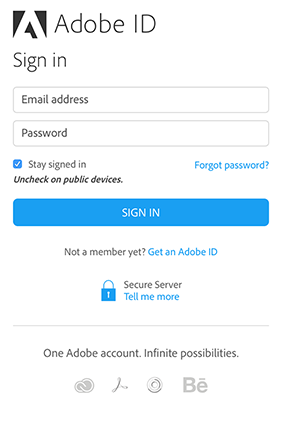
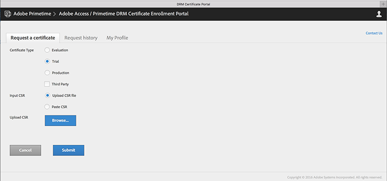
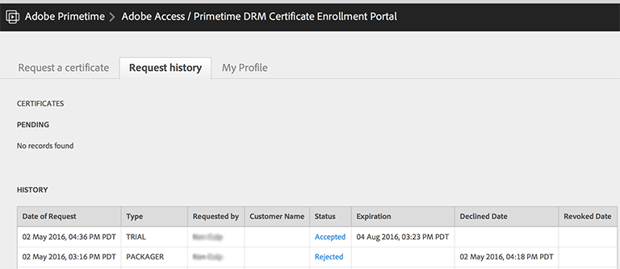
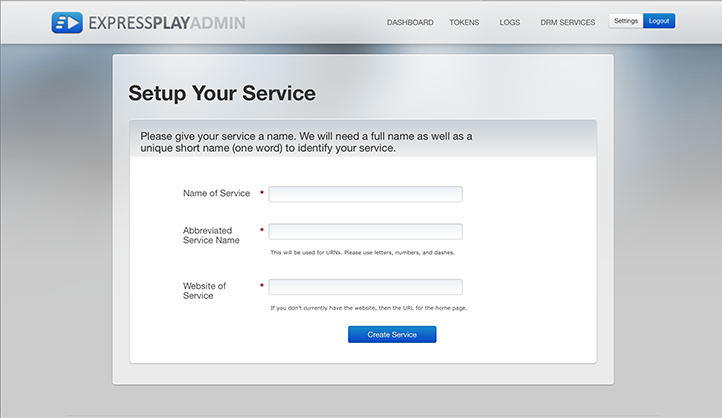
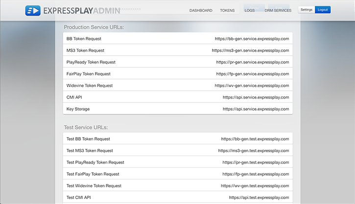
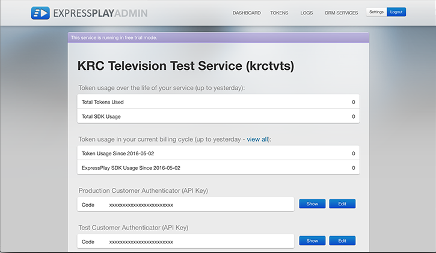

# Get Provisioned (Accounts, etc.) {#get-provisioned-accounts-etc}

To get started with Primetime DRM Cloud, powered by ExpressPlay, you need to set up Adobe Cert and ExpressPlay accounts with the help of your Adobe representative.

1. Contact your Adobe representative and request the Adobe Cert and ExpressPlay accounts you will need for implementing Multi-DRM with TVSDK.

       Provide your Adobe representative with the email address you will be using as your contact point. Adobe then creates two accounts for you:

    * ***Certificate Portal Account*** - ( https://certportal.primetime.adobe.com) : The *Adobe Access / Primetime DRM Certificate Enrollment Management Team* sends an email to the addresses you provided them. The email includes the URL for the Adobe cert portal, along with a link to Adobe's certificate enrollment documentation (latest docs are here: [Certificate Enrollment Guide](../../../digital-rights-management/certificate-enrollment-guide/title-page/about-certs.md)).
    
    * ***ExpressPlay Account*** - Adobe sends you an email that contains a link you use to register for your ExpressPlay Admin account.

1. Log in to the Adobe cert portal using your Adobe ID (use the same email address that you provided to your Adobe representative). If you don't have an Adobe ID yet, you can quickly create one by following the *Get an Adobe ID* link from the cert portal:

   <!---->

   

1. On the Adobe cert portal, request a *Trial* cert.

   For the Multi-DRM trial, a single trial cert will cover all of these aspects of content protection: packaging, licensing, and transport. You will need to supply your own [CSR](../../../digital-rights-management/certificate-enrollment-guide/title-page/request-certs/gen-cert-signing-req.md) to make a request for a cert: 
   <!---->

   

   Adobe will send you an email that indicates acceptance or rejection of your cert request. You can see the status of your cert request(s) on the *Request history* tab on the cert portal:
   <!---->

   

1. Create your ExpressPlay Admin account.

   Follow the link to ExpressPlay that Adobe provided to you. This opens the *Create an Account* page at ExpressPlay. Fill in the required information and submit the form. You will receive an email from `operations@expressplay.com` containing an activation link that is good for a week. After you activate, set up your ExpressPlay service:
   <!---->

   

   When you have created your service, you are presented with your own Admin page. Along with some activity tracking fields, you will see your Production and Test *customer authenticators* (API keys), and your Production and Test service URLs:

   <!---->

    

1. If you are using FairPlay, there are additional steps involved (on the Apple developer site) to get set up with ExpressPlay. See [Enable ExpressPlay service for FairPlay](../../multi-drm-workflows/p-l-and-p/enable-expressplay-for-fairplay.md) for instructions.
