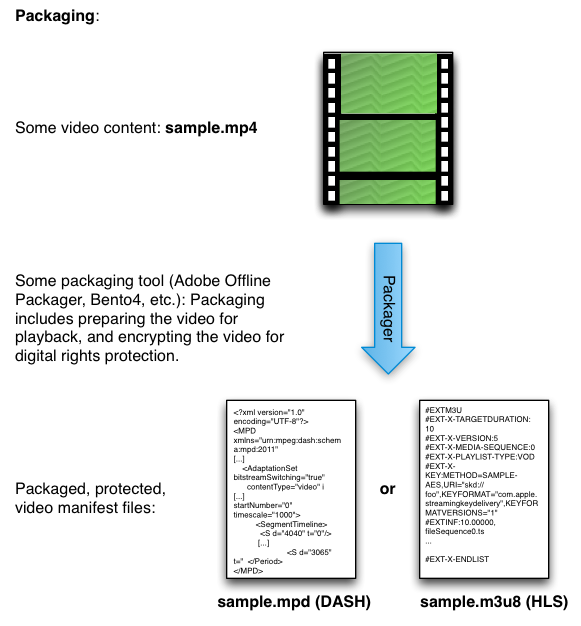

# Package Your Content{#package-your-content}

Packaging content is the process of preparing video content for playback over the web. Packaging includes transforming raw video into manifest files, and optionally encrypting the content using different DRM solutions for different devices and browsers.

To prepare your content, you can use either Adobe Offline Packager or other tools such as ExpressPlay's Bento4 packager. Packagers both prepare the video for playback (e.g., fragmenting the original file and putting it into a manifest), and protect the video with your chosen DRM solution (PlayReady, Widevine, FairPlay, Access, etc.):

* [Adobe Offline Packager](http://help.adobe.com/en_US/primetime/packagers/offline/index.html#Packagers-concept-Primetime_Offline_Packager_Getting_Started) 
* [ExpressPlay Packagers](http://www.expressplay.com/developer/packaging-tools/)

<a id="fig_jbn_fw5_xw"></a>



1. Package or otherwise obtain content to use for testing your setup.

   One of the crucial points to remember for packaging is that the Key ID (Content ID) that you use in this packaging step is the same one you must provide in your subsequent license token request. The Key ID is the only item that identifies your CEK (which may be stored in your own key management database, or stored using [ExpressPlay's Key Storage Service](http://www.expressplay.com/developer/key-storage/). 

   >[!NOTE]
   >
   >For those familiar with Adobe Access, this is an important difference in how the different solutions work. In Access, the License key is embedded in the DRM Metadata and passed back and forth with the protected content. In the Multi-DRM systems described here, the actual License is not passed, but stored securely and obtained via the Key ID.

<a id="example_52AF76B730174B79B6088280FCDF126D"></a>

Here is a packaging example using Adobe Offline Packager for Widevine. The Packager uses a configuration file (e.g., [!DNL widevine.xml]), which looks something like this: 

```
<config> 
<in_path>sample.mp4</in_path> 
<out_type>dash</out_type> 
<out_path>dash2</out_path> 
<drm/> 
<drm_sys>widevine</drm_sys> 
<frag_dur>4</frag_dur> 
<target_dur>6</target_dur> 
<key_file_path>keyfile.bin</key_file_path> 
<widevine_content_id>2a</widevine_content_id> 
<widevine_provider>intertrust</widevine_provider> 
<widevine_key_id>7debe705d938c76bfd886f077b8fa5f7</widevine_key_id> 
</config>
```

* `in_path` - This entry points to the location of the source video on your local packaging machine. 
* `out_type` - This entry describes the type of the packaged output, in this case DASH (for Widevine protection on HTML5). 
* `out_path` - The location on the local machine where you want your output to go. 
* `drm_sys` - The DRM solution you are packaging for. This will be either `widevine`, `fairplay`, or `playready`. 

* `frag_dur` and `target_dur` are DASH-specific duration entries pertaining to video playback. 

* `key_file_path` - This is the location of the license file on your packaging machine that serves as your Content Encryption Key (CEK). It is a Base-64 encoded 16-byte hex string. 
* `widevine_content_id` - This is Widevine "boilerplate"; it is always `2a`. (Do not confuse this with the `widevine_key_id`.) 

* `widevine_provider` - For our purposes, always set this to `intertrust`. 

* `widevine_key_id` - This is the identifier for the license you specified in the `key_file_path` entry. In other words, this identifies the key you use to encrypt the content. This ID is a 16-byte HEX string that you create yourself.

As stated in the [Packager documentation](http://help.adobe.com/en_US/primetime/packagers/offline/index.html#Packagers-concept-Working_with_Offline_Packager), "As a best practice, create a configuration file that contains the common options that you want to use for generating the outputs. Then, create the output by providing specific options as a command-line argument." In this case, our config file is fairly complete, so you could create your output as follows:

```
java -jar OfflinePackager.jar -conf_path widevine.xml -out_path test_dash/ 

```

>[!NOTE]
>
>Command-line parameters take precedence over config file parameters. In this example, everything required is in the config file, but we have overridden the output path specified in the config file with `-out_path test_dash/`.

