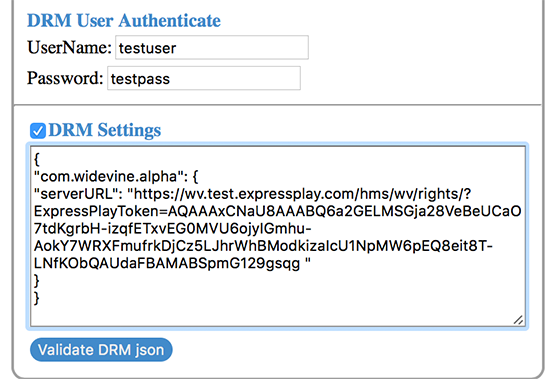

# Playback your protected content {#playback-your-protected-content}

To test your DRM solution, you need a video application that can process the particular DRM solution you are working with. This player could be a sample player made available by Adobe, or your own TVSDK-based video application.

1. Use the License Server URL from the token response you got back from the ExpressPlay server to test whether you can play back your protected content.

    * **Widevine** - Use the Widevine response directly as received from your ExpressPlay license token request. 
    * **PlayReady** - Get the License Server URL and token from the JSON object returned from your license token request. 
    * **FairPlay** - Use the FairPlay response directly as received from your ExpressPlay license token request.

1. Test playback of your protected content utilizing either your own player, or an existing Adobe sample player.

    Provide the URL to your protected content (the location of your M3U8 or MPD manifest, depending upon which DRM solution you are testing).

    Depending upon the interface provided by the player you test with, you may be asked to supply the license URL and token separate as strings in input fields, or as a JSON object pasted into a text box, or perhaps as a query parameter in the URL. 
 
    Some possibilities for test players are listed here:

    * HTML5 Reference Player:
    
      ```    
      https://ptdemos.com/html5/internal/1_2/2.4_GM/samples/reference/reference_player.html
      ```    
    
    * Shaka Player:
    
      ```    
      https://shaka-player-demo.appspot.com
      ```    
    
    * Sample TVSDK Player (under development) -     
    
    ```    
    https://drmtest2.adobe.com/TVSDK_HTML5/samples/reference/reference_player.html
    ```

    **Checking playback when testing your FairPlay setup:** FairPlay requires some extra steps to play back content when you are using the ExpressPlay license servers. If you are using [!DNL curl] to test your connections (as described in [Licensing](../../multi-drm-workflows/quick-start/handle-the-licensing.md)), you need to *edit your M3U8 manifest* (your packaged content) as follows:

1. Add the response you got back from your license token request to the `#EXT-X-KEY:` tag in the manifest; and 
1. Change the protocol of that URL from the response (now in the manifest), from `https://` to `skd://`.

   Here is a complete example for testing playback with FairPlay, including the licensing step:

1. Use the FairPlay license token request to obtain your license token URL. (Use your own Production Customer Authenticator, and be sure to use the same CEK and `iv` that was used to package your FairPlay content.) Run the following command to obtain the license token URL for the example content:     

    ```    
    curl -v "https://fp-gen.service.expressplay.com/hms/fp/token? 
    customerAuthenticator=[YOUR-PRODUCTION-AUTHENTICATOR]&errorFormat=json 
    &contentKey CEK as query parameter contentKey 
    =[YOUR CONTENT KEY]&iv=[YOUR IV]"
    ```    

    You should get a response back with the license token URL that looks something like this:     

    ```    
    https://fp.service.expressplay.com:80/hms/fp/rights/? 
    ExpressPlayToken=AQAAABNlKcEAAABQaTjshua3cWjG_Il3fvhf3g-CR1rn 
    JKdtaVaAnhkfTCW0bWAU76YgwForbrXhD5tXUHhfP7FD1svvLPxN5qomYsnwY 
    SSwcDq1ZnRtXunFLueTw6LAL52aZllMLasCSzYRMaAVHw 
    ```

1. Put the returned license token URL response into your M3U8 manifest, and *change the scheme of license token URL to* `sdk://` from `https://`. Following is an example of the #EXT-X-KEY tag in your M3U8 manifest:     

    ```    
    #EXT-X-KEY:METHOD=SAMPLE-AES, 
    URI="skd://fp.service.expressplay.com:80/hms/fp/rights/? 
    ExpressPlayToken=AQAAABNlKcEAAABQaTjshua3cWjG_Il3fvhf3g- 
    CR1rnJKdtaVaAnhkfTCW0bWAU76YgwForbrXhD5tXUHhfP7FD1svvLPx 
    N5qomYsnwYSSwcDq1ZnRtXunFLueTw6LAL52aZllMLasCSzYRMaAVHw", 
    KEYFORMAT="com.apple.streamingkeydelivery",KEYFORMATVERSIONS="1"
    ```

    >[!NOTE] {importance="high"}
    >
    >The preceding information applies only to the testing of your FairPlay setup. It may not apply to your production setup, depending upon how you configure your FairPlay handler. See [Enable Apple FairPlay in iOS applications](../../../programming/tvsdk-3.3-for-ios/c-psdk-ios-3.3-drm-content-security/c-psdk-ios-3.3-apple-fairplay-tvsdk.md) for details.

If your video plays, you've successfully packaged and licensed your content. If your video does not play, check the troubleshooting page for some possible solutions to your troubles. 

<!--<a id="example_603D92A1F3924467B5D66EC862B8F59C"></a>-->

For example, here is the part of the UI in the first test player listed above, where you supply the licensing information obtained from the ExpressPlay server:

<!--<a id="fig_zjy_q2c_rw"></a>-->


