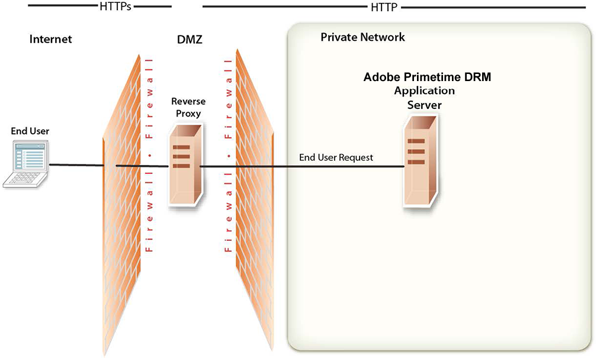

# Network topology overview{#network-topology-overview}

After you successfully deploy Adobe Primetime DRM, you must maintain the security of the Primetime DRM production server.

>[!NOTE]
>
>Primetime DRM was previously known as Adobe Access, and before that, Flash Access.

You can use a *reverse proxy* to ensure that different sets of URLs for Primetime DRM web applications are available to external and internal users. *Reverse proxy* is more secure than allowing users to connect directly to the application server on which Primetime DRM runs, and this configuration performs all HTTP requests for the application server that runs Primetime DRM. Users can access only reverse proxy and can attempt only the URL connections that are supported by the reverse proxy. 

