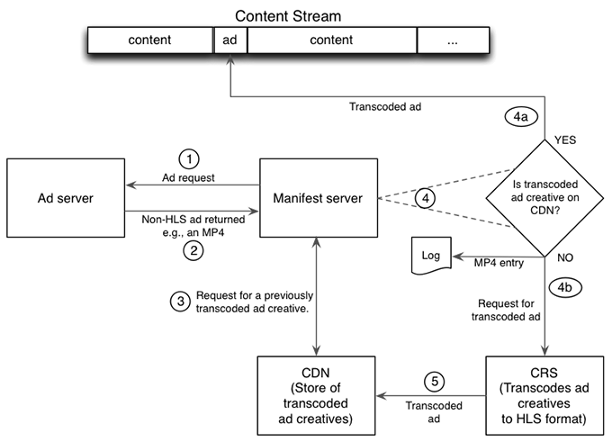
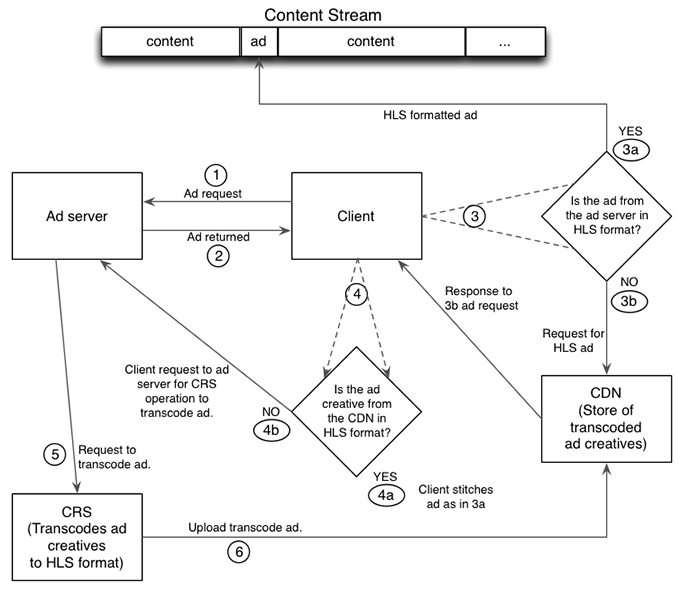

# Detailed Workflows for JIT Repackaging {#detailed-workflows-for-jit-repackaging}

Either a client video player or the manifest server can interact with CRS to achieve JIT repackaging. Both use the same ad selection logic.

## JIT Repackaging Initiated by the Manifest Server {#section_1F1C1B7DD146403890C2B43E24FEF0EB}

The workflow for JIT repackaging on the manifest server side is as follows:

1. The manifest server makes a request to the ad server. 
1. The manifest server receives an ad creative that is not in HLS format. 
1. The manifest server sends a request to the CDN server for a previously transcoded HLS version of the ad creative.

   >[!NOTE]
   >
   >In a multi-CDN setup, the manifest server uses the `ptcdn` parameter in the bootstrap URL to identify the CDN server.

1. The manifest server checks the response:

    1. If the request succeeds, the manifest server inserts the previously transcoded HLS version of the ad creative into the content stream. 
    1. If the request fails, the manifest server generates a log entry and requests a transcoded version from CRS.

1. CRS transcodes the ad creative and uploads the HLS version to the CDN server for future use.

For all subsequent requests for that creative, the manifest server retrieves the HLS version from the CDN and inserts it into the content stream.

## JIT Repackaging Initiated by the Client {#section_FBC97D40043F4FDD98247A08BB6195B0}

<!---->

A client based on TVSDK or with similar capabilities can interact with CRS to achieve JIT repackaging, as follows:

1. The client requests an ad from the ad server. 
1. The ad server returns the ad to the client. 
1. The client checks the format of the ad from the ad server:

   1. If the ad creative is in HLS format, the client inserts (stitches) it into the content, and is done. 
   1. If the ad creative is not in HLS format, the client requests one from the CDN server.     
    
      >[!NOTE]
      >
      >In a multi-CDN setup, the manifest server uses the `ptcdn` parameter in the bootstrap URL to identify the CDN server.

1. The client checks the response from the CDN server.

   1. If the CDN provided an HLS version, the client inserts (stitches) it into the content, and is done. 
   1. If the CDN server does not provide an HLS version, the client asks the ad server to request one from CRS. The client does not insert the ad into the content.

1. Ad server requests that the non-HLS ad be transcoded to HLS. 
1. CRS creates an HLS version and uploads it to the CDN server for future use.

## Ad Format Priorities and Timeline {#section_A74DE37A57BF45D7B6D09E3DE40F8E61}

The manifest server and the client use the same selection logic to determine the priorities for playing available ads. HLS-formatted ads are first priority, followed by MP4, FLV, and finally WebM.

CRS typically requires 2-4 minutes to process a non-HLS ad creative, and usually less than 3 minutes.

CRS produces different HLS bit rates, so the ad can play at a speed suitable to the available connection speed and bandwidth. If there are multiple available bit rates, CRS chooses the highest bit rate available. If CRS receives a non-HLS ad creative, it produces an HLS version at the highest resolution available.