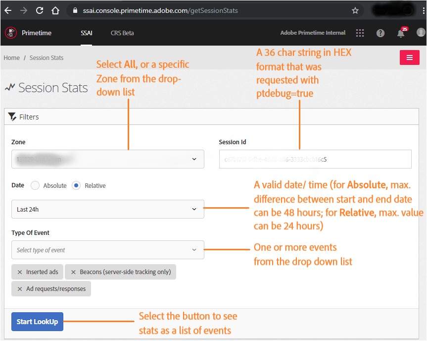

# Server Side Ad Insertion Debugging Dashboard {#ssai-tracking-dashboard}

The **[!UICONTROL Session Stats]** section in the SSAI dashboard takes manifest server debugging to the next level. It captures vital session activities that give insights into [debugging information related to an SSAI session](manifest-server-debugging-tool.md). If a session's debug mode is enabled ([ptdebug=true](manifest-server-debugging-tool.md#debugging-tool-options)), the Session Stats section aids publishers in server side tracking and investigating potentially costly ad insertion problems.
Publishers can look up the following activities for an SSAI session, after specifying the Session Id, Zone, Date, and Type of Event:  

* Ad requests and responses
* Inserted ads
* Beacons (server-side tracking only)

>[!Note]
>
>You can look up the activity for a specific Session ID up to 30 days after that SSAI session took place.

Publishers can look up the SSAI activity as the following event types:
| Event type | Format |
|---|---|
|TRACE_AD_CALL|`<hostname>   <event_log_timestamp> <request_id>  <session_id>  <zone>    TRACE_AD_CALL   <status>  <delay>   <queryURL>    <adSystemId>  <avail_id>    <avail_duration>  <ad_response_xml_base64_encoded>`|
|TRACE_AD_REDIRECT|`<hostname>   <event_log_timestamp> <request_id>  <session_id>  <zone>    TRACE_AD_REDIRECT   <status>  <avail_id>    <avail_type>  <ad_duration_seconds> <ad_content_url>  <ad_content_url_actual>   <adSystemId>  <ad_id>   <creative_id> <ad_request_id>   <delta>`|
|TRACE_AD_RESOLVE|`<hostname>   <event_log_timestamp> <request_id>  <session_id>  <zone>    TRACE_AD_RESOLVE    <status>  <avail_id>    <avail_type>  <ad_duration_seconds> <ad_content_url>  <ad_content_url_actual>   <adSystemId>  <ad_id>   <creative_id> <ad_request_id>   <delta>`|
|TRACE_AD_INSERT|`<hostname>   <event_log_timestamp> <request_id>  <session_id>  <zone>    TRACE_AD_INSERT <status>  <avail_id>    <avail_type>  <ad_duration_seconds> <ad_content_url>  <ad_content_url_actual>   <adSystemId>  <ad_id>   <creative_id> <ad_request_id>   <delta>`|
|TRACE_TRANSCODING_NO_MEDIA_TO_TRANSCODE|`<hostname>   <event_log_timestamp> <request_id>  <session_id>  <zone>    TRACE_TRANSCODING_NO_MEDIA_TO_TRANSCODE <qAdId>`|
|TRACE_TRANSCODING_REQUESTED|`<hostname>   <event_log_timestamp> <request_id>  <session_id>  <zone>    TRACE_TRANSCODING_REQUESTED <qAdId>   <avail_id>    <adManifestURL>   <creativeType>    <flags>   <targetDuration>  <cdn>`|
|TRACE_MISC|`<hostname>   <event_log_timestamp> <request_id>  <session_id>  <zone>    TRACE_MISC  <status>  <event_message>`|
|TRACKING_URL|`{HOSTNAME:hostname} {TIMESTAMP_ISO8601:timestamp}{WORD:request_id} {UUID:session_id} {WORD:zone} (?<event>TRACKING_URL) {DATA:status_line} {NUMBER:status}{URI:event_url} {DATA:headers}`|

## Export the SSAI Stats {#export-ssai-stats}

Select the **[!UICONTROL Download as Excel]** button to export the SSAI Session Stats as CSV. The order of fields for specific events in the exported CSV file are described in the following table:

| Event Type | Order of fields in CSV |
|---|---|
| TRACE_AD_CALL | Date, Request ID, Session ID, Zone, event, Response Code, Delay, Request URL, Ad System, Avail ID, Avail Duration, XML Response (base 64 encoded) |
| TRACE_AD_REDIRECT / TRACE_AD_RESOLVE / TRACE_AD_INSERT | Date, Request ID, Session ID, Zone, event, Response Code, Avail ID, Ad Type, Ad Duration, Creative URL, Inserted URL, Ad System, Ad ID, Creative ID, Ad Request ID |
| TRACE_TRANSCODING_REQUESTED | Date, Request ID, Session ID, Zone, event, Response Code, Delay, Creative URL, Creative Type, Flags, Target Duration, CDN |
| TRACE_TRANSCODING_NO_MEDIA_TO_TRANSCODE | Date, Request ID, Session ID, Zone, event, Q Ad ID |
| TRACKING_URL | Date, Request ID, Session ID, Zone, event, Status, Response Code, Beacon URL, Headers |

>[!See Also]
>
>* [Manifest Server debugging tool](manifest-server-debugging-tool.md)
>* [Overview of Manifest Server interactions](msapi-topics/ms-overview.md)
