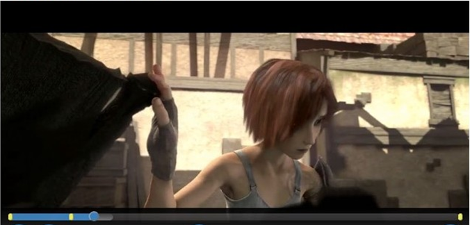

# Inspect the playback timeline{#inspect-the-playback-timeline}

You can obtain a description of the timeline that is associated with the currently selected item that is being played by Browser TVSDK. This description is useful when your application displays a custom scrub-bar control in which the content sections that correspond to ad content are identified.

Here is a sample implementation: 

{width="676pt"}

