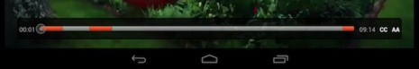

# Display the duration, current time, and remaining time of the video{#display-the-duration-current-time-and-remaining-time-of-the-video}

You can use TVSDK to retrieve information about the player's position in the media and display it on the seek bar.

1. Wait for the player to be in at least the PREPARED state.
1. Retrieve the current playhead time by using the `MediaPlayer.getCurrentTime` method.

   This returns the current playhead position on the virtual timeline in milliseconds. The time is calculated relative to the resolved stream that might contain multiple instances of alternate content, such as multiple ads or ad breaks spliced into the main stream. For live/linear streams, the returned time is always in the playback window range.

   ```java
   long getCurrentTime() throws MediaPlayerException;
   ```

1. Retrieve the playback range of the stream and determine the duration.
   1. Use the `MediaPlayer.getPlaybackRange` method to get the virtual timeline time range.

      ```java   
      TimeRange getPlaybackRange() throws MediaPlayerException;
      ```

   1. Use the `MediaPlayer.getPlaybackRange` method to get the virtual timeline time range.

       * For VOD, the range always begins with zero and the end value equals the sum of the main content duration and the durations of additional content in the stream (ads). 
       * For a linear/live asset, the range represents the playback window range. This range changes during playback.

          TVSDK calls the `ITEM_Updated` callback to indicate that the media item was refreshed and that its attributes, including the playback range, were updated. 
       
1. Use the methods that are available on `MediaPlayer` and on the `SeekBar` class in the Android SDK to set up the seek-bar parameters.

   For example, here is a possible layout that contains the seek bar and two `TextView` elements. 

   ```xml
   <LinearLayout 
    android:id="@+id/controlBarLayout" 
    android:layout_width="match_parent" 
    android:layout_height="wrap_content" 
    android:layout_alignParentBottom="true" 
    android:background="@android:color/black" 
    android:orientation="horizontal" > 
    <TextView 
       android:id="@+id/playerCurrentTimeText" 
       android:layout_width="wrap_content" 
       android:layout_height="wrap_content" 
       android:layout_margin="7dp" 
       android:text="00:00" 
       android:textColor="@android:color/white" /> 
    <SeekBar 
       android:id="@+id/playerSeekBar" 
       android:layout_width="wrap_content" 
       android:layout_height="wrap_content" 
       android:layout_weight="1" /> 
    <TextView 
       android:id="@+id/playerTotalTimeText" 
       android:layout_width="wrap_content" 
       android:layout_height="wrap_content" 
       android:layout_margin="7dp" 
       android:text="00:00" 
       android:textColor="@android:color/white" /> 
   </LinearLayout>
   ```

1. Use a timer to periodically retrieve the current time and update the seek bar, as shown in the figure:

   <!--<a id="fig_689CEDDD02094C0C8E91C5195F8EAD3F"></a>-->

   {width="477.000pt"}

   The following example uses the `Clock.java` helper class, which is available in `ReferencePlayer`, as the timer. This class sets an event listener and triggers an `onTick` event every second, or another timeout value that you can specify. 

   ```java
   playbackClock = new Clock(PLAYBACK_CLOCK, CLOCK_TIMER); 
   playbackClockEventListener = new Clock.ClockEventListener() { 
       @Override 
       public void onTick(String name) { 
           // Timer event is received. Update the seek bar here. 
       } 
   }; 
   playbackClock.addClockEventListener(playbackClockEventListener);
   ```

   On every clock tick, this example retrieves the media player's current position and updates the seek bar. It uses the two `TextView` elements to mark the current time and the playback range end position as numeric values. 

   ```java
   @Override 
   public void onTick(String name) { 
       if (mediaPlayer != null &&  
         mediaPlayer.getStatus() == MediaPlayerStatus.PLAYING) { 
           handler.post(new Runnable() { 
               @Override 
               public void run() { 
                   seekBar.setProgress((int) mediaPlayer.getCurrentTime()); 
                   currentTimeText.setText(timeStampToText(mediaPlayer.getCurrentTime())); 
                   totalTimeText.setText(timeStampToText(mediaPlayer.getPlaybackRange().getEnd())); 
               } 
           }); 
       } 
   } 
   
   ```

